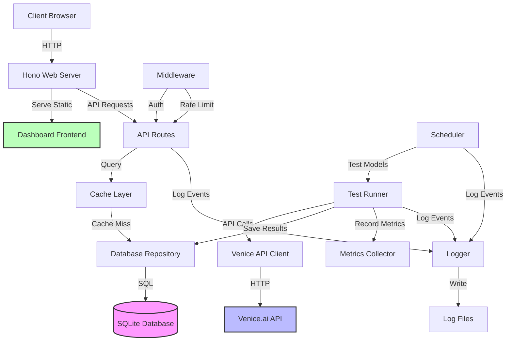
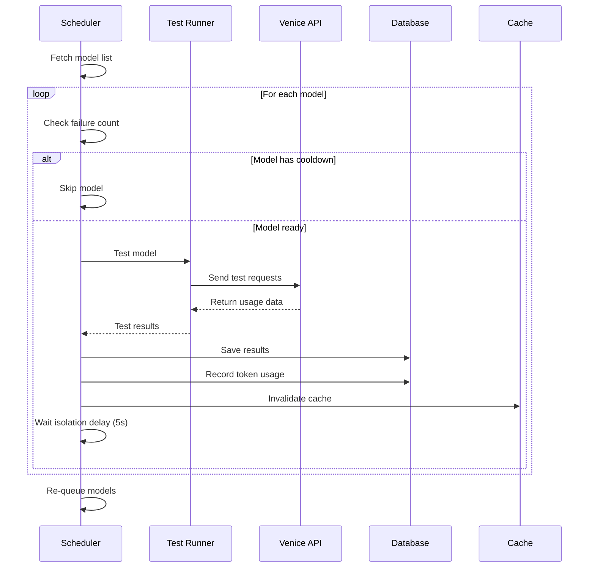
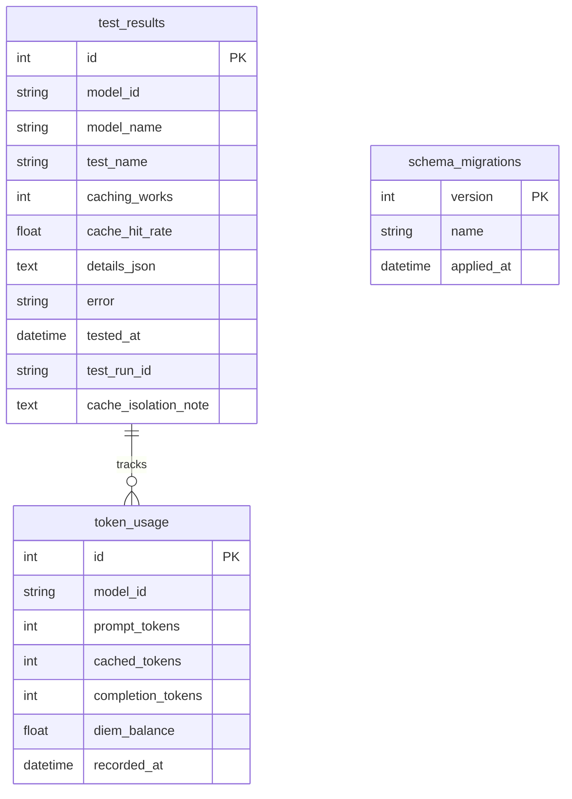
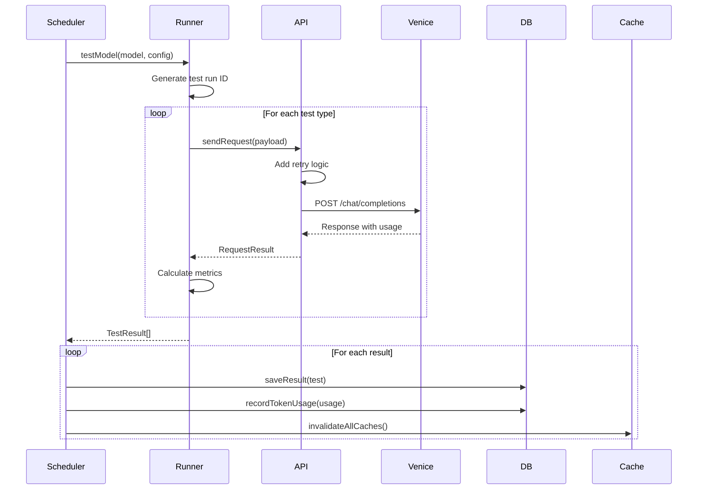
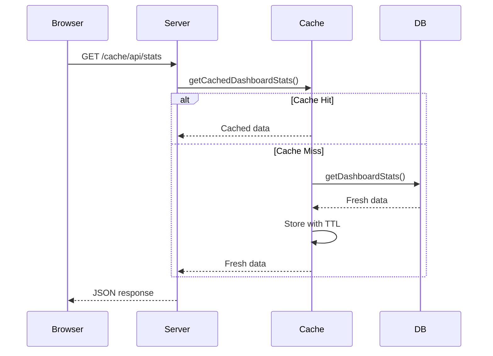

# Architecture Documentation

## Overview

The Venice Caching Health Monitor is a comprehensive test suite and web dashboard built to monitor Venice.ai's prompt caching support across different AI models. The system continuously tests models, stores results in SQLite, and provides a real-time web dashboard for monitoring.

## System Architecture

## Component Breakdown

### 1. Entry Point (`server.ts`)

The main entry point that:
- Initializes environment configuration
- Starts the Hono web server
- Auto-starts the scheduler
- Handles graceful shutdown (SIGTERM/SIGINT)
- Closes database connections on exit

### 2. Web Server (`src/server/`)

**Framework**: Hono (lightweight web framework)

**Components**:
- `index.ts` - Server setup, CORS, static file serving, cache busting
- `routes/api.ts` - All API endpoints
- `middleware/auth.ts` - Optional API key authentication
- `middleware/rateLimiter.ts` - Rate limiting (100 req/min per IP)

**Features**:
- MD5-based cache busting for CSS/JS files
- CORS configuration (development vs production)
- Static file serving for dashboard
- Comprehensive error handling

### 3. Scheduler (`src/scheduler/`)

**Purpose**: Continuously test models in the background

**Workflow**:

**Features**:
- One model at a time (sequential testing)
- 5-second isolation delay between models
- Failure tracking with cooldown periods
- Automatic recovery when balance increases
- Balance monitoring (stops if < 0.001 DIEM)
- Automatic cleanup every 24 hours (30-day retention)
- Cache cleanup every 5 minutes

**Failure Handling**:
- Tracks consecutive failures per model
- Warns after 3 consecutive failures
- Skips model after 5 consecutive failures (15-minute cooldown)
- Resets failure count after 2 consecutive successes
- Aggregates error types for reporting

### 4. Core Testing Engine (`src/core/`)

**Components**:

#### API Client (`api.ts`)
- Venice API communication
- Retry logic with exponential backoff (3 attempts)
- Timeout handling (30s default, configurable)
- Error categorization (rate_limit, api_error, timeout)
- Request ID tracking for correlation
- Optional debug logging

#### Test Runner (`runner.ts`)
- Orchestrates test execution
- Generates unique test run IDs for cache isolation
- Calculates metrics (cache hit rate, reliability score)
- Aggregates results from multiple test types

#### Test Types (`tests/`)
1. **Basic** - Identical requests to check for cached tokens
2. **Prompt Sizes** - Tests small/medium/large/xlarge prompts
3. **Partial Cache** - Same system prompt, different user messages
4. **Persistence** - 10 sequential requests to test cache durability
5. **TTL** - Tests cache lifetime with varying delays (1s, 5s, 10s, 30s)

#### Logger (`logger.ts`)
- File-based logging with rotation (10MB max, 5 rotated files)
- Structured logging (text or JSON format)
- Correlation ID tracking
- Log levels: INFO, WARN, ERROR

### 5. Database Layer (`src/db/`)

**Database**: SQLite with WAL mode (concurrent reads)

**Schema**:

**Repository Pattern** (`repository.ts`):
- `saveResult()` - Save test results
- `recordTokenUsage()` - Track token consumption
- `getDashboardStats()` - Compute overview statistics
- `getModelStats()` - Calculate per-model metrics
- `getHistory()` - Historical data for charts
- `cleanupOldData()` - Remove data older than 30 days

**Migration System** (`migrations/`):
- Versioned migration files
- Automatic tracking in `schema_migrations` table
- Forward-only (no rollback support)
- Runs automatically on server start

### 6. Cache Layer (`src/cache/`)

**Purpose**: Reduce database load for frequently accessed data

**Implementation**: In-memory TTL-based cache

**Cached Data**:
- Dashboard stats (30s TTL)
- Model stats (30s TTL)
- Sparklines (30s TTL)

**Features**:
- Automatic expiration
- Cache invalidation on new test results
- Hit/miss tracking
- Periodic cleanup (every 5 minutes)

**Cache Repository** (`cache/repository.ts`):
- `getCachedDashboardStats()` - Cached dashboard overview
- `getCachedModelStats()` - Cached model statistics
- `getCachedModelSparklines()` - Cached trend data
- `invalidateAllCaches()` - Clear all cached data

### 7. Metrics Collection (`src/metrics/`)

**Purpose**: Observability and monitoring

**Metrics Tracked**:
- Test duration (histogram)
- API response time (histogram)
- Cache hits/misses (counter)
- Errors by type (counter)
- Test results (counter)
- Active tests (gauge)
- Scheduler cycle duration (histogram)
- Process uptime (gauge)

**Export Formats**:
- Prometheus format (default)
- JSON format (via query parameter)

### 8. Dashboard Frontend (`src/dashboard/`)

**Technology**: Vanilla JavaScript + Chart.js

**Features**:
- Terminal-aesthetic dark theme
- Real-time health status badge
- Sortable model table with provider filtering
- Inline sparkline charts (last 10 tests)
- Cache Microscope for live testing
- Reproducible curl commands
- Auto-refresh every 60 seconds
- Token usage statistics
- Test evidence logs with expandable details

**Files**:
- `index.html` - Dashboard structure
- `app.js` - Dashboard logic and API calls
- `styles.css` - Terminal-aesthetic styling

## Data Flow

### Test Execution Flow

### Dashboard Request Flow

## Configuration Management

### Environment Variables (`src/config/env.ts`)

**Validation**:
- Required: `VENICE_API_KEY`
- Optional: `PORT`, `ALLOWED_ORIGINS`, `NODE_ENV`, `DEBUG_API_REQUESTS`, `DASHBOARD_API_KEY`, `LOG_FORMAT`
- Validation on startup with clear error messages

### Constants (`src/config/constants.ts`)

**Categories**:
- Scheduler constants (intervals, thresholds, cooldowns)
- Cache constants (TTL, cleanup intervals)
- Test constants (timeouts, delays, retry limits)

## Security Features

### Authentication
- Optional API key via `X-API-Key` header
- Bypass for health check endpoints
- Configurable via `DASHBOARD_API_KEY` environment variable

### Rate Limiting
- 100 requests per minute per IP address
- In-memory tracking with automatic cleanup
- Rate limit headers in all responses
- HTTP 429 with `Retry-After` header when exceeded

### CORS
- Development: Allows localhost origins
- Production: Strict origin checking
- Configurable via `ALLOWED_ORIGINS` environment variable

## Error Handling Strategy

### API Client
- 3 retry attempts with exponential backoff (2s, 4s, 8s)
- Automatic retry on rate limits (HTTP 429)
- Timeout detection and categorization
- Structured error responses with types

### Scheduler
- Failure tracking per model
- Cooldown periods for failing models
- Error aggregation for reporting
- Automatic recovery mechanisms

### Database
- Transaction support for atomic operations
- Graceful degradation on query failures
- Connection pooling (single connection for SQLite)

## Performance Optimizations

### Caching Strategy
- 30-second TTL for dashboard data
- Automatic invalidation on new results
- Periodic cleanup to prevent memory leaks

### Database Optimizations
- Indexes on frequently queried columns
- WAL mode for concurrent reads
- Automatic cleanup of old data (30-day retention)

### Scheduler Optimizations
- Sequential testing to avoid rate limits
- 5-second isolation delay between models
- Cooldown periods for failing models
- Balance monitoring to prevent wasted API calls

## Deployment Considerations

### Resource Requirements
- **Memory**: ~50-100MB (depends on cache size)
- **Disk**: ~10MB + database growth (~1MB per 1000 tests)
- **CPU**: Minimal (mostly I/O bound)

### Scaling
- Single instance design (SQLite limitation)
- Horizontal scaling requires migration to PostgreSQL/MySQL
- Consider read replicas for high-traffic dashboards

### Monitoring
- Health endpoint: `/cache/api/health`
- Metrics endpoint: `/cache/api/metrics`
- Scheduler status: `/cache/api/scheduler`
- Log files: `./data/test.log`

### Backup Strategy
- Database: `./data/cache-health.db`
- Logs: `./data/test.log*`
- Backup frequency: Daily recommended
- Retention: 30 days (configurable)

## Future Enhancements

### Potential Improvements
1. **Database**: Migrate to PostgreSQL for horizontal scaling
2. **Frontend**: Migrate to React/Vue/Svelte with TypeScript
3. **Testing**: Add integration tests for API endpoints
4. **Observability**: Integrate with Datadog/Grafana
5. **Authentication**: Add OAuth2/JWT support
6. **Notifications**: Add alerting for persistent failures
7. **API**: Add GraphQL endpoint for flexible queries
8. **Caching**: Add Redis for distributed caching

### Known Limitations
1. SQLite limits concurrent writes (single writer)
2. No horizontal scaling support
3. In-memory cache lost on restart
4. No real-time updates (60s polling)
5. No user management or multi-tenancy

## Glossary

- **Cache Hit Rate**: Percentage of tokens served from cache
- **Cache Isolation**: Unique test run IDs prevent cache pollution
- **DIEM Balance**: Venice.ai account balance
- **Reliability Score**: 0-100 score based on success rate, caching consistency, and effectiveness
- **Test Run ID**: UUID injected into prompts for cache isolation
- **TTL**: Time To Live - cache expiration time
- **WAL Mode**: Write-Ahead Logging - SQLite mode for concurrent reads
